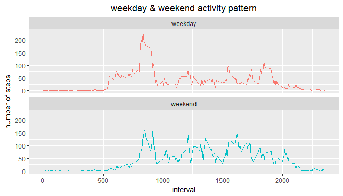

# RepData_PeerAssessment1
yucan  
2017-9-15  


# 1.Introduction

It is now possible to collect a large amount of data about personal movement using activity monitoring devices such as a Fitbit, Nike Fuelband, or Jawbone Up. These type of devices are part of the "quantified self" movement -- a group of enthusiasts who take measurements about themselves regularly to improve their health, to find patterns in their behavior, or because they are tech geeks. But these data remain under-utilized both because the raw data are hard to obtain and there is a lack of statistical methods and software for processing and interpreting the data.

  This assignment makes use of data from a personal activity monitoring device. This device collects data at 5 minute intervals through out the day. The data consists of two months of data from an anonymous individual collected during the months of October and November, 2012 and include the number of steps taken in 5 minute intervals each day.

#2.Data

The data for this assignment can be downloaded from the course web site: 

*  Dataset: [Activity monitoring data](https://d396qusza40orc.cloudfront.net/repdata%2Fdata%2Factivity.zip) [52K]  

The variables included in this dataset are: 

*  steps: Number of steps taking in a 5-minute interval (missing values are coded as NA)  
* date: The date on which the measurement was taken in YYYY-MM-DD format  
* interval: Identifier for the 5-minute interval in which measurement was taken  

  The dataset is stored in a comma-separated-value (CSV) file and there are a total of 17,568 observations in this dataset.

# 3.Assignment

##3.1. Loading and preprocessing the data

remove varitables in cash, load packages "plyr"and "ggplot2"

```r
rm(list = ls())
Sys.setlocale("LC_TIME", "English")
library(plyr)
library(ggplot2)
```
read data ,then process data by changing the format of "date"" from char to date.  

```r
act <- read.csv(".//data//activity.csv",header = TRUE,stringsAsFactors = FALSE)
act$date <- as.Date(act$date,format = "%Y-%m-%d")
summary(act)
```

```
##      steps             date               interval     
##  Min.   :  0.00   Min.   :2012-10-01   Min.   :   0.0  
##  1st Qu.:  0.00   1st Qu.:2012-10-16   1st Qu.: 588.8  
##  Median :  0.00   Median :2012-10-31   Median :1177.5  
##  Mean   : 37.38   Mean   :2012-10-31   Mean   :1177.5  
##  3rd Qu.: 12.00   3rd Qu.:2012-11-15   3rd Qu.:1766.2  
##  Max.   :806.00   Max.   :2012-11-30   Max.   :2355.0  
##  NA's   :2304
```

##3.2. What is mean total number of steps taken per day?

this is a histogram of the total number of steps taken each day. it ignores the missing values in the dataset.


```r
df0 <- ddply(act,.(date),summarize,tsteps=sum(steps,na.rm = TRUE))
ggplot(df0,aes(x = date,y = tsteps)) + 
    geom_col() + 
    labs(y = "total number of steps",
         title = "total number of steps taken each day") + 
    theme(plot.title = element_text(hjust = 0.5))
```

<!-- -->
    

the mean and median total number of steps taken per day


```r
mean(df0$tsteps,na.rm = TRUE)
```

```
## [1] 9354.23
```

```r
median(df0$tsteps,na.rm = TRUE)
```

```
## [1] 10395
```

##3.3. what is the average daily activity pattern?

this is a time series plot of the 5-minute interval (x-axis) and the average number of steps taken, averaged across all days (y-axis)


```r
df1 <- ddply(act,.(interval),summarize,msteps=mean(steps,na.rm = TRUE)) 
ggplot(df1,aes(x = interval,y = msteps)) + 
    geom_line() +
    labs(y = "mean number of steps",
         title = "the average daily activity pattern") +
    theme(plot.title = element_text(hjust = 0.5))
```

<!-- -->

Which 5-minute interval, on average across all the days in the dataset, contains the maximum number of steps?  the answer is 835

```r
df1[which.max(df1$msteps),]
```

```
##     interval   msteps
## 104      835 206.1698
```
##3.4. Imputing missing values

there are a number of days/intervals where there are missing values (coded as NA).
The presence of missing days may introduce bias into some calculations or summaries of the data.

total number of missing values in the dataset 

```r
sum(is.na(act)) 
```

```
## [1] 2304
```

Create a new dataset that is equal to the original dataset but with the missing data filled in as the mean for that correspond 5-minute interval.

```r
act2 <- merge(act,df1,by="interval")
pos <- which(is.na(act2$steps))
act2$steps[pos] <- act2$msteps[pos]
act2 <- act2[,c(1:3)]
str(act2)
```

```
## 'data.frame':	17568 obs. of  3 variables:
##  $ interval: int  0 0 0 0 0 0 0 0 0 0 ...
##  $ steps   : num  1.72 0 0 0 0 ...
##  $ date    : Date, format: "2012-10-01" "2012-11-23" ...
```

this is the  a histogram of the total number of steps taken each day after filling in the NA values

```r
df2 <- ddply(act2,.(date),summarize,tsteps=sum(steps,na.rm = TRUE)) 
ggplot(df2,aes(x = date,y = tsteps)) + geom_col()  +
    labs(y = "total number of steps",
         title = "total number of steps taken each day") + 
    theme(plot.title = element_text(hjust = 0.5))
```

<!-- -->

Calculate and report the mean and median total number of steps taken per day. 


```r
mean(df2$tsteps,na.rm = TRUE)
```

```
## [1] 10766.19
```

```r
median(df2$tsteps,na.rm = TRUE)
```

```
## [1] 10766.19
```
Do these values differ from the estimates from the first part of the assignment? 
What is the impact of imputing missing data on the estimates of the total daily number of steps?  
both mean and median increase

```r
tmpdf <- data.frame(no= c(1:2),
                    mean = c(mean(df0$tsteps,na.rm = TRUE),mean(df2$tsteps,na.rm = TRUE)),
                    median = c(median(df0$tsteps,na.rm = TRUE),median(df2$tsteps,na.rm = TRUE)))
ggplot(tmpdf,aes(x = mean,y = median,color = no)) + 
    geom_line() + geom_point() +  
    labs(title = "mean & median change ") + 
    theme(plot.title = element_text(hjust = 0.5)) + 
    theme(legend.position="none")
```

<!-- -->

##3.5. Are there differences in activity patterns between weekdays and weekends?

Create a new factor variable wd in the dataset with two levels -- "weekday" and "weekend"

* weekday is "Saturday" or "Sunday",wd is weekend
* other condition ,wd is  weekday


```r
act2$wd = as.factor(ifelse( weekdays(act2$date) %in% c("Saturday","Sunday"),
                            "weekend","weekday"))
summary(act2)
```

```
##     interval          steps             date                  wd       
##  Min.   :   0.0   Min.   :  0.00   Min.   :2012-10-01   weekday:12960  
##  1st Qu.: 588.8   1st Qu.:  0.00   1st Qu.:2012-10-16   weekend: 4608  
##  Median :1177.5   Median :  0.00   Median :2012-10-31                  
##  Mean   :1177.5   Mean   : 37.38   Mean   :2012-10-31                  
##  3rd Qu.:1766.2   3rd Qu.: 27.00   3rd Qu.:2012-11-15                  
##  Max.   :2355.0   Max.   :806.00   Max.   :2012-11-30
```

this plot contains a time series of the 5-minute interval (x-axis) and the average number of steps taken, averaged across all weekday days or weekend days (y-axis). 


```r
df3 <- ddply(act2,.(wd,interval),summarize,msteps=mean(steps,na.rm = TRUE)) 
ggplot(df3,aes(x = interval,y = msteps,color = wd)) + 
    geom_line() +  
    facet_wrap(~wd,ncol = 1) +
    labs(y = "number of steps",title = "weekday & weekend activity pattern") + 
    theme(plot.title = element_text(hjust = 0.5)) + 
    theme(legend.position="none")
```

<!-- -->

